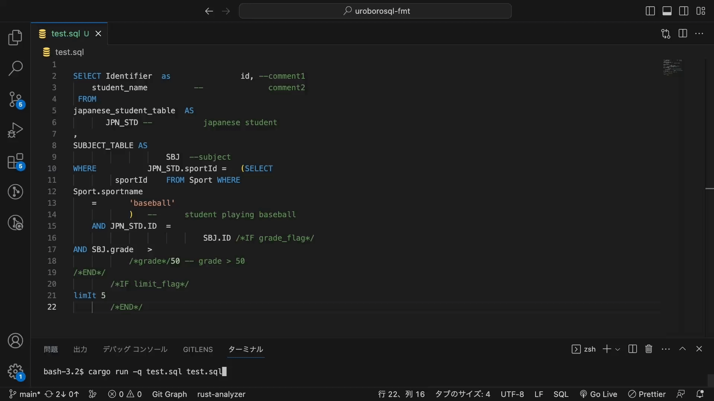
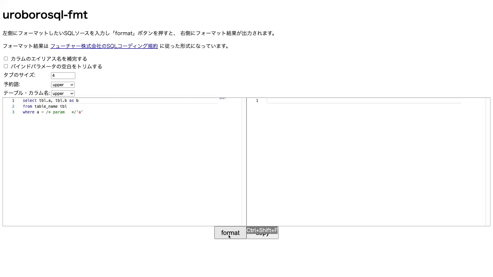

# uroboroSQL-fmt




uroboroSQL-fmt is a tool that formats SQL statements according to [SQL coding standards created by Future Corporation](https://future-architect.github.io/coding-standards/documents/forSQL/SQL%E3%82%B3%E3%83%BC%E3%83%87%E3%82%A3%E3%83%B3%E3%82%B0%E8%A6%8F%E7%B4%84%EF%BC%88PostgreSQL%EF%BC%89.html) (Japanese only).

It instantly converts indentation, line breaks, and case distinctions in SQL statements to improve readability and manageability.

Our previous tool, [uroboroSQL formatter](https://github.com/future-architect/uroboroSQL-formatter), was made in python and used lexical analysis to format.

Tools based on lexical analysis had difficulty in processing parentheses, etc., and because it was made in Python, it was difficult to make it a VSCode extension.

Therefore, we have created this tool made in Rust, which formats using parsing.

The main features:

- Written in Rust.
- Only PostgreSQL is supported.
  - However, not all PostgreSQL syntax is supported.
- Supports 2way-sql such as [uroboroSQL](https://future-architect.github.io/uroborosql-doc/) and [doma2](https://doma.readthedocs.io/en/latest/).
- Some Auto Fix functions are available.
- All indentation is done in tabs.
- **Leading comma style**, not a trailing comma style.

	```sql
	SELECT
		A	AS	A
	,	B	AS	B
	,	C	AS	C
	```

- [VSCode extension](https://marketplace.visualstudio.com/items?itemName=Future.uroborosql-fmt) is available.
- You can try the [demo by wasm](https://future-architect.github.io/uroborosql-fmt/) ([Japanese](https://future-architect.github.io/uroborosql-fmt/ja)).



## Install

Please install [Rust](https://www.rust-lang.org/tools/install) before installing.

```sh
cargo install --git https://github.com/future-architect/uroborosql-fmt
```

## Usage

### Command line output

```sh
uroborosql-fmt-cli input.sql
```

The formatting result of `input.sql` will output to the command line.

### File output

```sh
uroborosql-fmt-cli input.sql result.sql
```

The formatting result of `input.sql` will output to `result.sql`.

### Configuration options

Create `.uroborosqlfmtrc.json` in the directory where you run the command and write the configuration there.

If there is no configuration file, the default values are used.

| name                                                                           | type                                 | description                                                                                                                                                                                                                                            | default |
| ------------------------------------------------------------------------------ | ------------------------------------ | ------------------------------------------------------------------------------------------------------------------------------------------------------------------------------------------------------------------------------------------------------ | ------- |
| [`debug`](docs/options/debug.md)                                               | bool                                 | Run in debug mode.                                                                                                                                                                                                                                     | false   |
| [`tab_size`](docs/options/tab_size.md)                                         | int                                  | Tab size used for formatting.                                                                                                                                                                                                                          | 4       |
| [`complement_alias`](docs/options/complement_alias.md)                         | bool                                 | Complement aliases. Currently, column names are auto-completed with the same name. (e.g. `COL1` → `COL1 AS COL1`)                                                                                                                                      | true    |
| [`trim_bind_param`](docs/options/trim_bind_param.md)                           | bool                                 | Trim the contents of the [bind parameters](https://future-architect.github.io/uroborosql-doc/background/#%E3%83%8F%E3%82%99%E3%82%A4%E3%83%B3%E3%83%88%E3%82%99%E3%83%8F%E3%82%9A%E3%83%A9%E3%83%A1%E3%83%BC%E3%82%BF). (e.g. `/* foo */` → `/*foo*/`) | false   |
| [`keyword_case`](docs/options/keyword_case.md)                                 | [`"upper"`, `"lower"`, `"preserve"`] | Unify the case of keywords. (No conversion in case of `"preserve"`)                                                                                                                                                                                    | lower   |
| [`identifier_case`](docs/options/identifier_case.md)                           | [`"upper"`, `"lower"`, `"preserve"`] | Unify the case of identifiers. (No conversion in case of `"preserve"`)                                                                                                                                                                                 | lower   |
| [`max_char_per_line`](docs/options/max_char_per_line.md)                       | int                                  | If the total number of characters in the function name and arguments exceeds `max_char_per_line`, the arguments are formatted with new lines.                                                                                                          | 50      |
| [`complement_outer_keyword`](docs/options/complement_outer_keyword.md)         | bool                                 | Complement the optional `OUTER`. (e.g. `LEFT JOIN` → `LEFT OUTER JOIN`)                                                                                                                                                                                | true    |
| [`complement_column_as_keyword`](docs/options/complement_column_as_keyword.md) | bool                                 | Complement `AS` in column aliases.                                                                                                                                                                                                                     | true    |
| [`remove_table_as_keyword`](docs/options/remove_table_as_keyword.md)           | bool                                 | Remove `AS` in table aliases.                                                                                                                                                                                                                          | true    |
| [`remove_redundant_nest`](docs/options/remove_redundant_nest.md)               | bool                                 | Remove redundant parentheses. (e.g. `(((foo)))` → `(foo)`)                                                                                                                                                                                             | true    |
| [`complement_sql_id`](docs/options/complement_sql_id.md)                       | bool                                 | Complement [SQL ID](https://palette-doc.rtfa.as/coding-standards/forSQL/SQL%E3%82%B3%E3%83%BC%E3%83%87%E3%82%A3%E3%83%B3%E3%82%B0%E8%A6%8F%E7%B4%84%EF%BC%88uroboroSQL%EF%BC%89.html#sql-%E8%AD%98%E5%88%A5%E5%AD%90).                                 | false   |
| [`convert_double_colon_cast`](docs/options/convert_double_colon_cast.md)       | bool                                 | Convert casts by `X::type` to the form `CAST(X AS type)`.                                                                                                                                                                                              | true    |
| [`unify_not_equal`](docs/options/unify_not_equal.md)                           | bool                                 | Convert comparison operator `<>` to `!=`                                                                                                                                                                                                               | true    |
| [`indent_tab`](docs/options/indent_tab.md)                                     | bool                                 | Switch the indentation style between tabs and spaces.                                                                                                                                                                                                  | true    |
| [`use_parser_error_recovery`](docs/options/use_parser_error_recovery.md)       | bool                                 | Enable error recovery in the SQL parser.                                                                                                                                                                                                               | true    |

## Structure

- [Overview of the process flow](docs/structure/overview_of_the_process_flow.md)
  - This tool uses [tree-sitter](https://github.com/tree-sitter/tree-sitter) and [tree-sitter-sql](https://github.com/future-architect/tree-sitter-sql) (upstream: [m-novikov/tree-sitter-sql](https://github.com/m-novikov/tree-sitter-sql)). Thanks to the developers of these tools.
- [How to format 2way-sql](docs/structure/how_to_format_2way_sql.md)

## License

[Business Source License 1.1](LICENSE)
