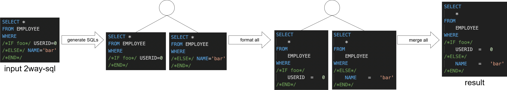

# How to format 2way-sql

To format 2way-sql, the formatter uses two complementary strategies:

## 1. Syntax error recovery

When the [parser error recovery](../options/use_parser_error_recovery.md) option is enabled, the formatter first attempts to parse the input using that mechanism.  
The recovery process corrects common syntax issues that often appear in hand-written SQL or in unfinished 2way-sql, for example:

- An extra comma at the beginning of a list (e.g., a leading comma in the column list).
- Unnecessary `AND`/`OR` placed immediately after the `WHERE` keyword.
- Missing sample values for bind parameters such as `/*foo*/`.
- Placeholder strings without values such as `/*#bar*/`.

For concrete examples, see the sample SQL in the option document linked above.
If the SQL is successfully recovered at this stage and no conditional branches remain, it is formatted immediately.

## 2. Branch enumeration and formatting

If the parser cannot parse the statement and conditional blocks such as `/*IF foo*/ … /*END*/` are present, the formatter switches to branch enumeration:

1. Generate all SQL statements that can result from evaluating all IF branches of the input.
2. Format each generated SQL independently.
3. Merge the formatted strings into a single output.
