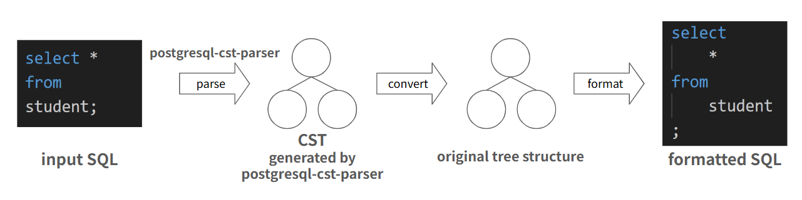

# Overview of the process flow

1. Parse input SQL with [postgresql-cst-parser](https://github.com/future-architect/postgresql-cst-parser) to get CST.
2. Parsing CSTs and converting them into their original tree structure.
3. Formatting and output using original tree structure.
